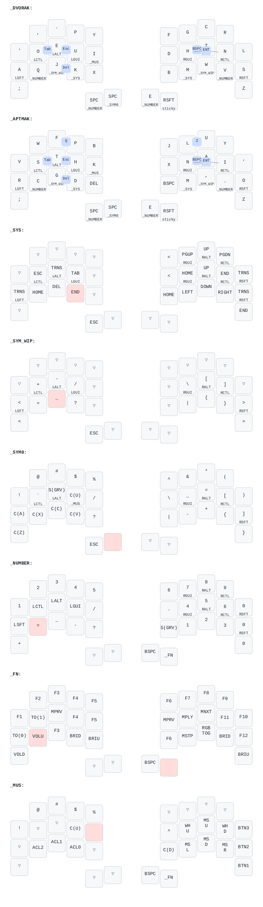

# QMK firmware for ferrise sweep

## Build command

```
qmk flash -kb cradio -km bmax
```

## Redraw keymap
```
./draw-keymap.sh
```

## Keymap
image generated using the awesome [keymap-drawer](https://github.com/caksoylar/keymap-drawer) tool

